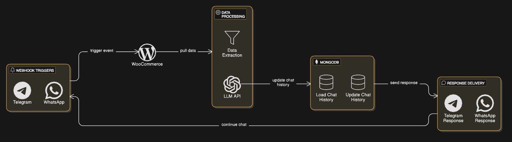
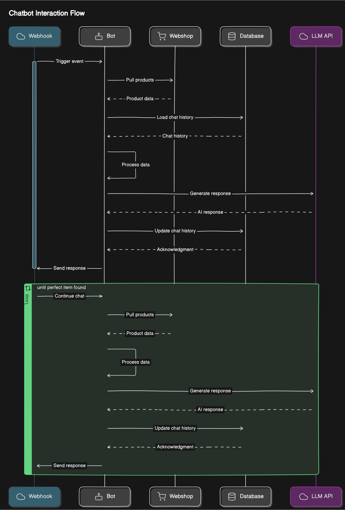

# Shop Assistant Bot

A conversational AI bot that helps users find products from a WooCommerce store through WhatsApp and Telegram messaging platforms.




## 🚨 Research Project Notice

**IMPORTANT**: This project is a research prototype and is not production-ready. It is intended for experimental and educational purposes only. Use at your own risk and do not deploy in a production environment without thorough testing and security enhancements.

## 📝 Overview

This bot connects WhatsApp and Telegram messaging platforms to your WooCommerce store, allowing customers to search for products through natural conversation. The system uses AI to understand user preferences and provide personalized product recommendations.

### Key Features

- Multi-platform support (WhatsApp and Telegram)
- Natural language product search
- Personalized recommendations
- Conversation memory
- Integration with WooCommerce product catalog

## 🚀 Getting Started

### Prerequisites

- Python
- MongoDB
- WooCommerce store
- WhatsApp Business API access (Optional)
- Telegram Bot Token (Optional)
- OpenAI API key (or other LLM provider)

### Installation Options

#### Option 1: Clone Repository

1. Clone the repository:

   ```bash
   git clone https://github.com/Blazp04/ecomerce-AI-bot
   cd ecomerce-AI-bot
   ```

2. Install dependencies:

   ```bash
   pip install -r requirements.txt
   ```

3. Configure environment variables (see Configuration section)

4. Start the application:
   ```bash
   python main.py
   ```

#### Option 2: Docker Compose (Recommended)

1. Clone the repository:

   ```bash
   git clone https://github.com/Blazp04/ecomerce-AI-bot
   cd ecomerce-AI-bot
   ```

2. Configure environment variables in a `.env` file (see Configuration section)

3. Run with Docker Compose:
   ```bash
   docker-compose up -d
   ```

## ⚙️ Configuration

Copy the `.env.template` file to create your own `.env` file:

```bash
cp .env.template .env
```

Then fill in the required environment variables:

```
# API
PORT=3000                          # Port for the API server

# Whatsapp
ACCES_TOKEN=your_access_token      # WhatsApp Business API access token
PHONE_NUMBER_ID=your_phone_id      # WhatsApp Business phone number ID
VERIFY_TOKEN=your_verify_token     # Custom verification token for webhook

# AI
LLM_PROVIDER_KEY=your_openai_key   # API key for OpenAI or other LLM provider
BASE_URL=https://api.openai.com    # Base URL for LLM API
MODEL=gpt-4-turbo                  # Model name to use

# MongoDB
MONGO_USERNAME=username            # MongoDB username
MONGO_PASSWORD=password            # MongoDB password
MONGO_HOST=localhost               # MongoDB host
MONGO_PORT=27017                   # MongoDB port

# WooComerce
WOOCOMMERCE_URL=https://your-store.com       # Your WooCommerce store URL
WOOCOMMERCE_CONSUMER_KEY=your_consumer_key   # WooCommerce API consumer key
WOOCOMMERCE_CONSUMER_SECRET=your_secret      # WooCommerce API consumer secret

# Telegram
TELEGRAM_BOT_TOKEN=your_bot_token  # Telegram bot token
```

## 🔌 Platform Setup

### WhatsApp Business API Setup

1. Create a Meta Developer account at [developers.facebook.com](https://developers.facebook.com/)
2. Create a Meta App in the Developer Dashboard
3. Add the WhatsApp product to your app
4. Set up a business account and connect a phone number
5. Generate a permanent access token
6. Configure the webhook URL: `https://your-domain.com/webhook`
7. Set the verification token (same as in your .env file)

For detailed instructions, refer to the [WhatsApp Business API documentation](https://developers.facebook.com/docs/whatsapp/cloud-api/get-started).

### Telegram Bot Setup

1. Talk to [@BotFather](https://t.me/botfather) on Telegram
2. Send `/newbot` command and follow instructions to create a new bot
3. Receive your HTTP API token
4. Set the webhook URL using the API:
   ```
   https://api.telegram.org/bot<YOUR_BOT_TOKEN>/setWebhook?url=https://your-domain.com/telegram/webhook
   ```

For detailed instructions, refer to the [Telegram Bot API documentation](https://core.telegram.org/bots/api).

### WooCommerce API Setup

1. Go to your WordPress admin panel
2. Navigate to WooCommerce → Settings → Advanced → REST API
3. Click "Add key"
4. Give it a description, select a user with admin permissions
5. Set permissions to "Read"
6. Generate API keys
7. Copy the Consumer Key and Consumer Secret to your .env file

For more information, see the [WooCommerce REST API documentation](https://woocommerce.github.io/woocommerce-rest-api-docs/).

## 💬 Usage

1. Start a conversation with your Telegram bot or WhatsApp business number
2. Describe what you're looking for in natural language
3. The bot will ask questions to better understand your needs
4. Products matching your criteria will be presented
5. Continue the conversation until you find the perfect product

### Resetting Conversation

To reset the conversation and delete chat history, simply send one of the following messages:

- "hello"
- "hi"
- "pozdrav"

The system will clear all previous conversations for your user ID.

## 🛠️ Webhook Endpoints

- WhatsApp webhook: `/webhook`
- Telegram webhook: `/telegram/webhook`

Make sure these endpoints are properly configured in your respective platform settings.

## 📊 Architecture

The bot follows a modular architecture:

1. **Webhook Receivers** - Handle incoming messages from WhatsApp and Telegram
2. **WooCommerce Connector** - Pulls product data from your store
3. **Data Processing Layer** - Extracts user intent and preferences
4. **LLM Module** - Generates natural language responses using AI
5. **MongoDB Database** - Stores conversation history
6. **Platform Connectors** - Send responses back to users

## 🤝 Contributing

Currently, we don't accept any contributions.

## 📄 License

This project is licensed under the MIT License - see the LICENSE file for details.
